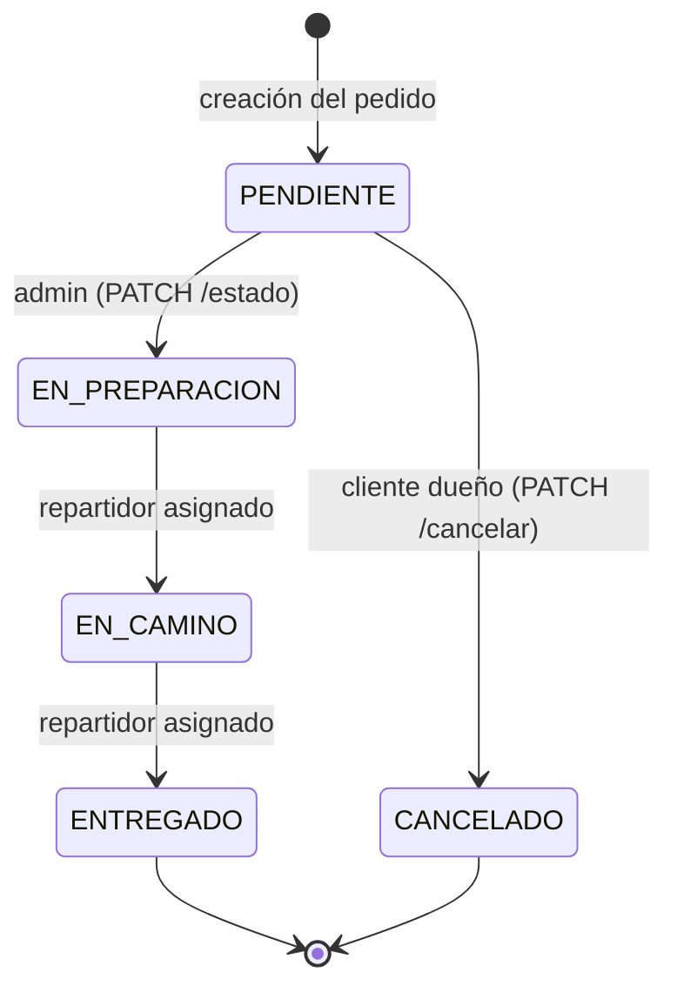
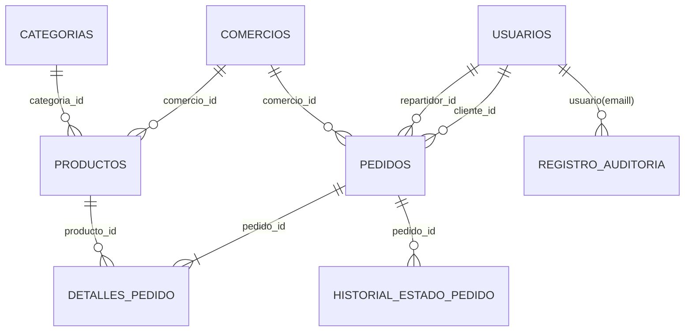
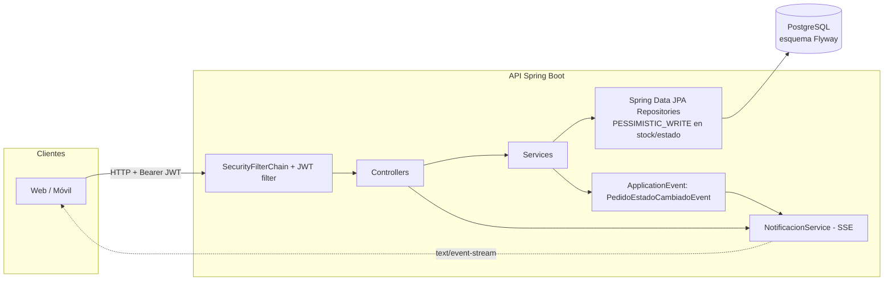

# Sistema de Delivery — API Backend

Backend completo de comercio electrónico / delivery (estilo PedidosYa) construido con
**Spring Boot 3 + Java 17 + PostgreSQL + JWT + Flyway**, siguiendo la especificación
de 16 secciones del proyecto.

La API permite gestionar comercios, catálogo e inventario, pedidos multiproducto con
máquina de estados, repartidores con asignación atómica y seguimiento en tiempo real
(SSE), con autenticación JWT stateless y autorización por roles.

---

## Tabla de contenidos

1. [Stack tecnológico](#stack-tecnológico)
2. [Requisitos previos](#requisitos-previos)
3. [Estructura del proyecto](#estructura-del-proyecto)
4. [Configuración](#configuración)
5. [Arranque](#arranque)
6. [Base de datos y migraciones](#base-de-datos-y-migraciones)
7. [Roles, seguridad y JWT](#roles-seguridad-y-jwt)
8. [Endpoints](#endpoints)
9. [Ejemplos de uso (curl)](#ejemplos-de-uso-curl)
10. [Máquina de estados del pedido](#máquina-de-estados-del-pedido)
11. [Modelo de datos](#modelo-de-datos)
12. [Arquitectura](#arquitectura)
13. [Pruebas](#pruebas)
14. [Documentación interactiva (Swagger)](#documentación-interactiva-swagger)
15. [Decisiones de seguridad y concurrencia](#decisiones-de-seguridad-y-concurrencia)

---

## Stack tecnológico

| Componente         | Versión / elección                            |
|--------------------|-----------------------------------------------|
| Java               | 17 (`--release 17`)                           |
| Spring Boot        | 3.5.16 (Web, Security, Data JPA, Validation)  |
| Base de datos      | PostgreSQL (Flyway `V1__crear_esquema_inicial.sql`) |
| Migraciones        | Flyway (única fuente del esquema; `ddl-auto: validate`) |
| Autenticación      | JWT HS256 con JJWT 0.12.7 (stateless)         |
| Contraseñas        | BCrypt (`BCryptPasswordEncoder`)              |
| Documentación      | springdoc-openapi 2.8.13 (`/swagger-ui.html`) |
| Notificaciones     | Server-Sent Events (SSE)                      |
| Pruebas            | JUnit 5, Mockito, MockMvc (surefire + failsafe) |
| Build              | Maven (wrapper `mvnw`) + Lombok               |

---

## Requisitos previos

- **JDK 17+** (el proyecto compila con `--release 17`; se probó con JDK 21).
- **PostgreSQL 14+** local o mediante Docker (`docker compose up -d db`).
- **Maven** no es necesario: se usa el wrapper `.\mvnw.cmd` (Windows) / `./mvnw` (Unix).
- Variables de entorno del entorno (o un archivo `.env` cargado por el shell).

> **Nota de red corporativa:** si Maven falla con errores `PKIX path building failed`,
> es porque un proxy/firewall intercepta TLS. Copie el `cacerts` de su JDK a
> `%USERPROFILE%\.java\cacerts`, importe la CA corporativa y defina
> `JAVA_TOOL_OPTIONS="-Djavax.net.ssl.trustStore=%USERPROFILE%\.java\cacerts -Djavax.net.ssl.trustStorePassword=changeit"`.

---

## Estructura del proyecto

```
main/
├── pom.xml
├── Dockerfile
└── src
    ├── main
    │   ├── java/com/sistemadelivery/main
    │   │   ├── config/          # OpenApiConfig, AdminInitializer
    │   │   ├── controller/      # Auth, Comercio, Producto, Categoria, Pedido, Repartidor, Admin
    │   │   ├── dto/             # request/ y response/ (records con Jakarta Validation)
    │   │   ├── entity/          # Usuario, Comercio, Categoria, Producto, Pedido, DetallePedido, HistorialEstadoPedido, RegistroAuditoria
    │   │   ├── entity/enums/    # Rol, EstadoPedido, CategoriaComercio
    │   │   ├── exception/       # ApiException + subclases + GlobalExceptionHandler
    │   │   ├── mapper/          # Usuario/Comercio/Producto/Categoria/Pedido/Auditoria
    │   │   ├── notification/    # SSE: NotificacionService + PedidoEstadoCambiadoEvent
    │   │   ├── repository/      # Spring Data JPA (+ bloques PESSIMISTIC_WRITE)
    │   │   ├── security/        # SecurityConfig, CustomUserDetailsService, handlers
    │   │   ├── security/jwt/    # JwtService, JwtAuthenticationFilter
    │   │   ├── service/         # interfaces + impl (lógica de negocio)
    │   │   ├── util/            # SeguridadUtil, TransicionesEstado
    │   │   └── validation/      # SinProductosDuplicados (validador de pedidos)
    │   └── resources
    │       ├── application.yml          # valores por defecto (env vars con defaults)
    │       ├── application-prod.yml     # perfil de producción estricto
    │       └── db/migration/V1__crear_esquema_inicial.sql
    └── test
        ├── java/...            # pruebas unitarias (*Test) e integración (*IT)
        └── resources/application-test.yml   # perfil de pruebas (BD sistema_delivery_test)
├── docker-compose.yml          # PostgreSQL + API (raíz)
├── .env.example                # plantilla de variables (raíz)
└── .gitignore
```

---

## Configuración

La aplicación se configura con variables de entorno. Copie `.env.example` a `.env`
y ajuste los valores (o exporte las variables directamente).

| Variable             | Default (no prod)        | Descripción |
|----------------------|--------------------------|-------------|
| `DB_HOST`            | `localhost`              | Host de PostgreSQL |
| `DB_PORT`            | `5432`                   | Puerto de PostgreSQL |
| `DB_NAME`            | `SistemaGestionPedidos`  | Base de datos |
| `DB_USERNAME`        | `postgres`               | Usuario de BD |
| `DB_PASSWORD`        | `admin`                  | Contraseña de BD |
| `JWT_SECRET`         | *(vacío → falla al arrancar)* | **Obligatoria**, mínimo 32 caracteres |
| `JWT_EXPIRATION_MS`  | `86400000` (24 h)        | Duración del token |
| `CORS_ALLOWED_ORIGINS` | `http://localhost:3000,http://localhost:5173` | Orígenes permitidos, separados por coma |
| `ADMIN_EMAIL`        | *(vacío)*                | Email del primer administrador (opcional) |
| `ADMIN_PASSWORD`     | *(vacío)*                | Contraseña del primer administrador |
| `SERVER_PORT`        | `8080`                   | Puerto HTTP |

Generar una clave JWT segura:

```bash
openssl rand -base64 48
```

---

## Arranque

### 1. Preparar PostgreSQL

Con Docker (recomendado si Docker está operativo):

```bash
docker compose up -d db
```

Con PostgreSQL local: cree la base de datos con el nombre indicado en `DB_NAME`
(si no existe, Flyway fallará):

```sql
CREATE DATABASE "SistemaGestionPedidos";
```

> El esquema se crea automáticamente por Flyway al primer arranque — **no** ejecute
> scripts a mano.

### 2. Ejecutar la API

```bash
# Windows (PowerShell)
$env:JWT_SECRET="<clave-de-32-caracteres-o-mas>"
.\mvnw.cmd spring-boot:run

# Unix
JWT_SECRET="<clave-de-32-caracteres-o-mas>" ./mvnw spring-boot:run
```

Flujo al arrancar:

1. Flyway valida y aplica las migraciones pendientes sobre la base configurada.
2. Hibernate valida el esquema (`ddl-auto: validate`) contra las entidades.
3. Si `ADMIN_EMAIL`/`ADMIN_PASSWORD` están definidos y no existe ningún ADMIN,
   `AdminInitializer` crea el primer administrador (una sola vez).
4. Tomcat escucha en `SERVER_PORT` (por defecto `8080`).

### 3. Docker completo (API + BD)

```bash
cp .env.example .env   # y editar JWT_SECRET
docker compose up --build
```

---

## Base de datos y migraciones

- **Flyway es la única fuente del esquema** (`locations: classpath:db/migration`).
- `V1__crear_esquema_inicial.sql` crea 8 tablas: `usuarios`, `comercios`,
  `categorias`, `productos`, `pedidos`, `detalles_pedido`,
  `historial_estado_pedido` y `registro_auditoria`, con claves foráneas, `CHECK`
  de roles/estados e índices.
- Hibernate usa `ddl-auto: validate`: si una entidad no coincide con el esquema,
  la aplicación **no arranca** (protección en desarrollo y producción).
- El perfil `prod` exige todas las variables de entorno reales (falla si falta una)
  y no incluye mensajes de error internos en las respuestas.

### Base de datos de pruebas

Las pruebas de integración usan una base **dedicada** `sistema_delivery_test`
(perfil `test`, `application-test.yml`). Si usa Docker: `CREATE DATABASE sistema_delivery_test;`.
Cada test de integración corre sobre una transacción que se revierte, por lo que
la base queda limpia entre ejecuciones.

---

## Roles, seguridad y JWT

Roles: **ADMIN**, **CLIENTE**, **REPARTIDOR**.

- Registro público (`POST /api/v1/auth/register`) crea **siempre** `CLIENTE`;
  el rol nunca viaja en la solicitud.
- Los administradores se crean únicamente con `ADMIN_EMAIL`/`ADMIN_PASSWORD`
  (Administrator inicial seguro, no existe endpoint de alta de ADMIN).
- Login devuelve un JWT firmado (HS256) con el email como `subject` y el rol como
  `claim`. Enviar como `Authorization: Bearer <token>`.
- Seguridad stateless: sin sesiones HTTP ni CSRF (el token viaja en cabecera).
- El rol se re-lee de la base en cada petición (`CustomUserDetailsService`):
  desactivar un usuario invalida sus permisos de inmediato.
- 401 y 403 responden JSON uniforme; los mensajes nunca revelan secretos.
- **Excepción controlada:** el filtro JWT acepta el token como `?access_token=...`
  únicamente en las rutas `/api/v1/pedidos/*/seguimiento` para poder abrir el
  flujo SSE desde un navegador sin exponer el token en el historial de `curl`.
- Autorización a nivel de recurso (no solo de rol): un cliente solo accede a sus
  pedidos, un repartidor a los asignados, y un admin a todo.

| Endpoint                        | Rol / acceso               |
|---------------------------------|----------------------------|
| `/api/v1/auth/**`               | Público                    |
| `GET /api/v1/categorias`        | Público                    |
| `GET /api/v1/comercios/**`      | Público (lectura)          |
| `GET /api/v1/productos/**`      | Público (lectura)          |
| `/swagger-ui/**`, `/v3/api-docs/**` | Público                |
| `POST/PUT/PATCH /comercios`, `/productos`, `/categorias` | ADMIN |
| `/api/v1/admin/**`              | ADMIN                      |
| `POST /api/v1/pedidos`, `GET /mis-pedidos`, `PATCH /{id}/cancelar` | CLIENTE |
| `GET /api/v1/pedidos`, `PATCH /{id}/estado` | ADMIN           |
| `/api/v1/repartidores/**`       | REPARTIDOR                 |
| `GET /api/v1/pedidos/{id}`, `/historial`, `/seguimiento` | dueño, repartidor asignado o ADMIN |

---

## Endpoints

### Autenticación (`/api/v1/auth`)

| Método | Ruta       | Rol     | Descripción |
|--------|------------|---------|-------------|
| POST   | `/register`| Público | Registra un **CLIENTE** y devuelve token (201) |
| POST   | `/login`   | Público | Inicia sesión y devuelve token (200) |

### Categorías (`/api/v1/categorias`)

| Método | Ruta        | Rol   | Descripción |
|--------|-------------|-------|-------------|
| GET    | `/`         | Público | Lista categorías |
| POST   | `/`         | ADMIN | Crea categoría |
| PUT    | `/{id}`     | ADMIN | Actualiza categoría |
| PATCH  | `/{id}/estado` | ADMIN | Activa/desactiva (`{"activo": true|false}`) |

### Comercios (`/api/v1/comercios`)

| Método | Ruta        | Rol   | Descripción |
|--------|-------------|-------|-------------|
| GET    | `/`         | Público | Lista comercios activos y abiertos (filtros `categoria`, `abierto`, `disponible`, paginado) |
| GET    | `/gestion`  | ADMIN | Lista de gestión (incluye inactivos/cerrados) |
| GET    | `/{id}`     | Público | Detalle de un comercio |
| POST   | `/`         | ADMIN | Crea comercio |
| PUT    | `/{id}`     | ADMIN | Actualiza comercio |
| PATCH  | `/{id}/estado` | ADMIN | Activa/desactiva comercio |

### Productos (`/api/v1/...`)

| Método | Ruta        | Rol   | Descripción |
|--------|-------------|-------|-------------|
| GET    | `/comercios/{comercioId}/productos` | Público | Catálogo (solo disponibles con stock). `gestion=true` (ADMIN) incluye todo |
| GET    | `/productos/{id}` | Público | Detalle del producto |
| POST   | `/comercios/{comercioId}/productos` | ADMIN | Crea producto |
| PUT    | `/productos/{id}` | ADMIN | Actualiza producto |
| PATCH  | `/productos/{id}/stock` | ADMIN | Ajuste absoluto de stock `{"stock": N}` |
| PATCH  | `/productos/{id}/disponibilidad` | ADMIN | `{"disponible": true\|false}` |

### Pedidos (`/api/v1/pedidos`)

| Método | Ruta        | Rol   | Descripción |
|--------|-------------|-------|-------------|
| POST   | `/`         | CLIENTE | Crea pedido multiproducto (201). Totales siempre se calculan en el servidor |
| GET    | `/mis-pedidos` | CLIENTE | Pedidos del cliente autenticado (paginado) |
| GET    | `/`         | ADMIN | Listado con filtros `estado`, `clienteId`, `repartidorId`, `desde`, `hasta` |
| GET    | `/{id}`     | Dueño/repartidor/ADMIN | Detalle con precios históricos congelados |
| PATCH  | `/{id}/cancelar` | CLIENTE (dueño) | Cancela un pedido PENDIENTE (devuelve el stock) |
| PATCH  | `/{id}/estado` | ADMIN | Transición administrativa `PENDIENTE → EN_PREPARACION` |
| GET    | `/{id}/historial` | Dueño/repartidor/ADMIN | Historial de cambios de estado |
| GET    | `/{id}/seguimiento` | Dueño/repartidor/ADMIN | SSE en tiempo real (eventos `conexion` y `estado`) |

### Repartidores (`/api/v1/repartidores`)

| Método | Ruta        | Rol   | Descripción |
|--------|-------------|-------|-------------|
| GET    | `/pedidos-disponibles` | REPARTIDOR | Pedidos EN_PREPARACION sin repartidor |
| GET    | `/mis-pedidos` | REPARTIDOR | Pedidos asignados al repartidor |
| POST   | `/pedidos/{id}/aceptar` | REPARTIDOR | Asignación atómica del pedido |
| PATCH  | `/pedidos/{id}/estado` | REPARTIDOR | `EN_CAMINO` o `ENTREGADO` (validado por la máquina de estados) |

### Administración (`/api/v1/admin`)

| Método | Ruta        | Rol   | Descripción |
|--------|-------------|-------|-------------|
| GET    | `/auditoria` | ADMIN | Registro de auditoría con filtros |
| GET    | `/estadisticas` | ADMIN | Pedidos por estado y ventas |
| GET    | `/usuarios` | ADMIN | Lista usuarios (filtro por rol) |
| GET    | `/repartidores` | ADMIN | Lista repartidores |
| POST   | `/usuarios` | ADMIN | Alta de usuario con rol CLIENTE o REPARTIDOR |

---

## Ejemplos de uso (curl)

### 1. Registrar un cliente

```bash
curl -s -X POST http://localhost:8080/api/v1/auth/register \
  -H "Content-Type: application/json" \
  -d '{"nombre":"Ana López","email":"ana@correo.com","password":"Clave#123","direccion":"Zona 10","telefono":"5555-0101"}'
```

### 2. Iniciar sesión

```bash
TOKEN=$(curl -s -X POST http://localhost:8080/api/v1/auth/login \
  -H "Content-Type: application/json" \
  -d '{"email":"ana@correo.com","password":"Clave#123"}' | jq -r .token)
```

### 3. Crear comercio y producto (ADMIN)

```bash
ADMIN_TOKEN=$(curl -s -X POST http://localhost:8080/api/v1/auth/login \
  -H "Content-Type: application/json" \
  -d '{"email":"admin@delivery.com","password":"ChangeMe-Admin-123!"}' | jq -r .token)

COMERCIO=$(curl -s -X POST http://localhost:8080/api/v1/comercios \
  -H "Authorization: Bearer $ADMIN_TOKEN" -H "Content-Type: application/json" \
  -d '{"nombre":"Pollería Central","categoria":"RESTAURANTE","direccion":"Zona 1"}' | jq -r .id)

PRODUCTO=$(curl -s -X POST http://localhost:8080/api/v1/comercios/$COMERCIO/productos \
  -H "Authorization: Bearer $ADMIN_TOKEN" -H "Content-Type: application/json" \
  -d '{"nombre":"Pollo 1/4","descripcion":"Porción individual","precio":25.50,"stock":10}' | jq -r .id)
```

### 4. Crear un pedido multiproducto (CLIENTE)

```bash
curl -s -X POST http://localhost:8080/api/v1/pedidos \
  -H "Authorization: Bearer $TOKEN" -H "Content-Type: application/json" \
  -d "{\"comercioId\":$COMERCIO,\"productos\":[{\"productoId\":$PRODUCTO,\"cantidad\":2},{\"productoId\":2,\"cantidad\":1}]}"
```

El servidor calcula: `subtotal 51.00 + subtotal 10.00 + envío fijo 20.00 = 71.00` (según productos),
descarta el stock bajo llave y responde `201` con el pedido en `PENDIENTE`.

### 5. Cancelar (devuelve el stock una sola vez)

```bash
curl -s -X PATCH http://localhost:8080/api/v1/pedidos/1/cancelar \
  -H "Authorization: Bearer $TOKEN"
```

### 6. Flujo administrativo / repartidor

```bash
# ADMIN: PENDIENTE → EN_PREPARACION
curl -s -X PATCH http://localhost:8080/api/v1/pedidos/1/estado \
  -H "Authorization: Bearer $ADMIN_TOKEN" -H "Content-Type: application/json" \
  -d '{"estado":"EN_PREPARACION"}'

# REPARTIDOR: aceptar y avanzar
curl -s -X POST http://localhost:8080/api/v1/repartidores/pedidos/1/aceptar -H "Authorization: Bearer $REPARTIDOR_TOKEN"
curl -s -X PATCH http://localhost:8080/api/v1/repartidores/pedidos/1/estado \
  -H "Authorization: Bearer $REPARTIDOR_TOKEN" -H "Content-Type: application/json" -d '{"estado":"EN_CAMINO"}'
curl -s -X PATCH http://localhost:8080/api/v1/repartidores/pedidos/1/estado \
  -H "Authorization: Bearer $REPARTIDOR_TOKEN" -H "Content-Type: application/json" -d '{"estado":"ENTREGADO"}'
```

### 7. Seguimiento en tiempo real (SSE)

```bash
curl -N http://localhost:8080/api/v1/pedidos/1/seguimiento?access_token=$TOKEN
```

Cada cambio de estado emite un evento `estado` con el nuevo estado, el actor y la
fecha; al conectar se envía un evento `conexion` para confirmar la suscripción.

---

## Máquina de estados del pedido

Implementada en `TransicionesEstado` y aplicada por `PedidoEstadoService`
(historial + auditoría + notificación en cada transición):



Cualquier otra transición se rechaza con `409 TRANSICION_INVALIDA`. La cancelación
solo es posible en `PENDIENTE`; devuelve el inventario exactamente una vez.

---

## Modelo de datos



Detalles relevantes:

- `pedidos.monto_total` / `costo_envio` / `detalles_pedido.precio_unitario` son
  **históricos congelados** al confirmar el pedido.
- `detalles_pedido` guarda `precio_unitario` y `subtotal` para precios que cambian
  en el catálogo sin afectar pedidos existentes.
- `pedidos.version` (optimistic lock): si una actualización concurrente choca, la
  transacción se revierte y el cliente recibe un error, nunca un dato inconsistente.
- `registro_auditoria` nunca almacena contraseñas ni tokens.

---

## Arquitectura



---

## Pruebas

```bash
# Pruebas unitarias (34) — no requiere base de datos
.\mvnw.cmd test

# Pruebas unitarias + integración (34 + 8) — requiere PostgreSQL y la BD sistema_delivery_test
.\mvnw.cmd verify
```

- **Unitarias (Mockito):** máquina de estados (`TransicionesEstado`), `AuthServiceImpl`
  (email duplicado → 409, rol fijo CLIENTE, login inválido → 401), `PedidoServiceImpl`
  (totales Q20.00, stock bajo llave, cancelación con devolución única, restricciones),
  `RepartidorServiceImpl` (asignación atómica, alcance del repartidor),
  `PedidoEstadoServiceImpl` (historial/auditoría/evento, rechazo de transiciones
  inválidas) y `JwtService` (round-trip de firma y validación de configuración).
- **Integración (MockMvc + PostgreSQL real):** flujo de autenticación (registro,
  login, 401 sin token, 403 cliente→admin, 409 duplicado) y el ciclo de vida
  completo de un pedido (creación → cancelación → preparación → asignación →
  entrega), incluidas las reglas de stock y de acceso a recursos ajenos.
- `surefire` ejecuta `*Test`; `failsafe` ejecuta `*IT` en la fase `verify`.

---

## Documentación interactiva (Swagger)

Con la API en ejecución:

- Swagger UI: <http://localhost:8080/swagger-ui.html>
- OpenAPI JSON: <http://localhost:8080/v3/api-docs>

---

## Decisiones de seguridad y concurrencia

- **Totales siempre del servidor:** el cliente envía solo `comercioId` y pares
  `productoId`/`cantidad`; precios, subtotales, envío fijo (Q20.00) y total se
  calculan con `BigDecimal` y escala 2.
- **Stock transaccional:** la creación de pedido y la cancelación bloquean las
  filas de producto con `PESSIMISTIC_WRITE` en **orden `id ASC`** (evita
  interbloqueos). Dos pedidos simultáneos se serializan; si no alcanza el stock,
  la transacción se revierte → `409 STOCK_INSUFICIENTE` sin consumo.
- **Devolución de stock única:** la cancelación bloquea el pedido
  (`findByIdForUpdate`); el segundo intento observa `CANCELADO` → `409`, por lo
  que el inventario se restaura exactamente una vez.
- **Asignación atómica de repartidor:** `SELECT ... FOR UPDATE` sobre el pedido;
  el segundo repartidor que intente aceptarlo recibe `409 PEDIDO_ASIGNADO`.
- **Estado siempre del contexto:** la identidad proviene del JWT validado
  (`SeguridadUtil`), nunca de campos del cuerpo de la solicitud.
- **Máquina de estados:** toda transición pasa por `PedidoEstadoService`, que
  valida, persiste el historial, audita y publica el evento SSE
  (`@TransactionalEventListener(AFTER_COMMIT, fallbackExecution = true)`).
- **Sin secretos en respuestas:** ni contraseñas, ni tokens en logs o cuerpos;
  `JWT_SECRET` solo se usa para firmar y validar.
- **Flyway + `validate`:** el esquema no lo genera Hibernate; cualquier
  discrepancia entre entidades y migraciones detiene el arranque.
- **Mensajes de error genéricos** en login (no revelan si el correo existe) y
  códigos de error estables (`EMAIL_DUPLICADO`, `STOCK_INSUFICIENTE`, ...) que el
  cliente puede manejar de forma determinística.